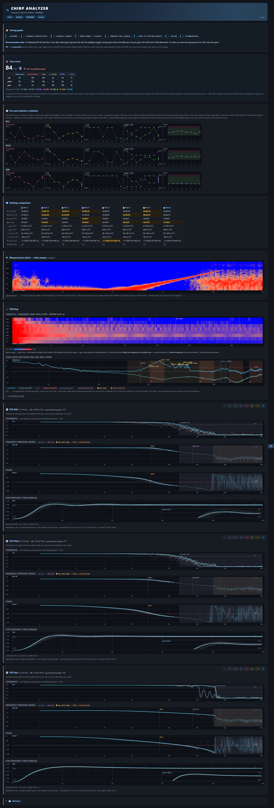

# betaflight-claude-skill

> **A Claude skill for Betaflight: FPV drone configuration, PID tuning, blackbox log analysis, and troubleshooting.**

[](https://opensource.org/licenses/Apache-2.0)
[](https://betaflight.com/)
[](https://platform.claude.com/docs/en/agents-and-tools/agent-skills/overview)

A [Claude](https://claude.ai) skill that helps you configure, tune, analyze, and troubleshoot FPV drones running Betaflight firmware. It works from the artifacts you already have — CLI dumps, blackbox logs, and plain-language descriptions of how the quad flies — and can also read and write directly to a live flight controller via the MCP server.

## What it does

Once loaded, the skill lets Claude:

- **Diagnose flight issues** from natural-language descriptions (wobbles, hot motors, oscillations, drift, propwash, jello)
- **Resolve arming failures** — decode every arming prevention flag (cause, fix, common pitfalls)
- **Fix connection problems** — MCU/USB driver and COM-port-not-found troubleshooting (Zadig, DFU, ImpulseRC Driver Fixer)
- **Parse and analyze CLI diff/dump files** you share
- **Turn a chirp log into a complete tuning report** *(flagship)* — closed-loop Bode (gain/phase/coherence) + step response per axis, a gyro noise spectrum with **motor harmonics located from eRPM** and the current filter cut-offs drawn on it, a chirp spectrogram, a before/after overlay of multiple logs, and plain-language tuning observations — all in one self-contained, **bilingual (FR/EN)** HTML report (`debug_mode = CHIRP`)
- **Decode blackbox logs** — full binary frame decode with per-field statistics and CSV export
- **Analyze gyro and motor noise spectra** — Welch PSD of gyroUnfilt vs gyroADC (filter effectiveness) and motor outputs; equivalent to the Blackbox Explorer noise tab
- **Analyze step response** — closed-loop system identification (setpoint → gyro) via Welch cross-spectral method; rise time, overshoot, settling time, coherence
- **Generate paste-ready CLI configs** for common build classes (5" freestyle, 3" cinewhoop, 7" longrange)
- **Guide you through a setup wizard** when configuring a new drone from scratch
- **Read and write a live FC** via the `betaflight-mcp` server (PIDs, filters, rates, ports — without a diff file)
- **Detect RC channel mapping** — passively sample the radio, identify Throttle/Aileron/Elevator/Rudder by function name, compare against Betaflight's `rcmap` and generate a correction if needed
- **Assign switches to flight modes** — flip a switch to the active position, Claude detects the channel and µs value and generates the `aux` command (ARM, BEEPER, ANGLE, etc.)
- **Migrate configurations** across major Betaflight versions (4.4 → 4.5 → 4.6 → 2025.12)
- **Flag deprecated parameters** that would error on import to newer firmware
- **Recommend safe value ranges** for PIDs, filters, rates, and ESC settings
- **Fetch official presets** from `betaflight/firmware-presets` at runtime — always up to date with the community, filterable by firmware version, category, and keywords

**Default tuning target:** Betaflight 2025.12 (4.5.x and 4.4.x differences are documented in `references/version-changes.md`).

## Installation

### Claude Code

```bash
# Per-user (all projects)
git clone https://github.com/SebGalina/betaflight-claude-skill.git ~/.claude/skills/betaflight

# Or per-project
git clone https://github.com/SebGalina/betaflight-claude-skill.git .claude/skills/betaflight
```

`SKILL.md` lives at the repository root, so the cloned folder *is* the skill. Claude triggers it automatically when a request looks Betaflight-related.

### claude.ai (web / mobile / desktop)

1. Download the attached `betaflight-claude-skill-v*.zip` asset from the latest [release](../../releases) (the runtime-only payload, not the "Source code" archive).
2. In Claude: **Settings → Capabilities → Skills → "+ Create skill"** and upload the zip.
3. The skill triggers automatically when relevant.

### Claude API

Upload via the Skills API — see the [official guide](https://platform.claude.com/docs/en/build-with-claude/skills-guide).

## Chirp analysis → guided tuning report

[](https://raw.githack.com/SebGalina/betaflight-claude-skill/main/scripts/full_report.html)

> 🔎 **[Open the live example report »](https://raw.githack.com/SebGalina/betaflight-claude-skill/main/scripts/full_report.html)** — a real multi-pass run, self-contained, with the live FR/EN toggle, hover tooltips and pass show/hide. (The screenshot above is the same report.)

The flagship workflow. `scripts/chirp_analysis.py` turns a closed-loop **chirp** log into a complete, self-contained tuning report. Betaflight's built-in chirp generator (`debug_mode = CHIRP`) sweeps a sine onto `currentPidSetpoint`, cycling roll → pitch → yaw. Generate it on the FC (`set debug_mode = CHIRP`, tune `chirp_*`), fly the dedicated identification flight, then:

```bash
# One log → one report. Auto-appends the pass to chirp_history.json next to the HTML,
# so each later run stacks on top ("au fil de l'eau" / incremental before-after):
python -m scripts.chirp_analysis flight.bbl --html report.html
python -m scripts.chirp_analysis flight_after_tweak.bbl --html report.html   # 2nd pass, stacks

# A fixed batch of logs in ONE report, exactly these, oldest → newest, ignoring any history:
python -m scripts.chirp_analysis stock.bbl tune1.bbl tune2.bbl tune3.bbl --no-history --html report.html

# Options: --lang en (initial UI language; FR/EN still toggles live in the HTML),
#          --json (machine-readable), --history FILE (custom history path).
```

The newest log on the line is the **reference pass** (it carries the tune score and the headline curves); the tune-score delta and the before/after overlay compare against the pass before it — so **list logs chronologically, oldest first**.

**Asking Claude (skill) to do it** — no command needed, just say so; trigger keywords: *chirp*, *tuning report*, *Bode / frequency response*, *step response*, *before/after tune*, *analyse mon log chirp*, *compare these chirp logs*.

The HTML opens offline (no external dependencies) and is a **bilingual (FR/EN, live toggle) guided assistant** ordered **Filtering → PID → History**:

- a composite **tune score** (0–100 + grade) per axis and overall, with the **delta vs the previous pass** and a per-pass scoreboard (★ on the best) — at-a-glance, is this config better or worse than the last;
- a **per-axis indicator evolution** panel across passes (overshoot, rise, settle, guaranteed margin, f(Ms), Ms) — each indicator with a colour + pictogram reused everywhere;
- per-axis **Bode** (gain dB / phase deg / coherence) + **step response** (with a zoomed inset on the overshoot), the guaranteed phase margin, and **inter-sweep repeatability bands** when a log holds several chirps on an axis;
- a **gyro noise spectrum** (raw vs filtered) with **motor harmonics located from eRPM**, the current filter cut-offs drawn on it, and which filters could be loosened or disabled;
- a **chirp spectrogram** (the rising sweep on a log axis), a throttle × frequency resonance map, and a **multi-pass overlay** with an exhaustive settings-comparison table + per-pass config tooltips for before/after;
- plain-language **observations** read directly from the PID/filter settings in the log — fully deterministic (no LLM), so the same log always gives the same report.

The firmware debug mapping is auto-detected (current BF logs only `debug[0]`; the legacy `debug[1..3]` path is kept as a fallback). `--json` is machine-readable; `--history`/`--no-history` control the accumulated history. See `references/chirp-tuning.md`.

> Chirp is a **compile-time** feature. Run `get chirp` in the CLI first — if `chirp_amplitude_roll` & co. don't appear, re-flash with the `CHIRP` build option enabled. **Never enable CHIRP on the ground** (firmware bug betaflight/betaflight#15012).

## Blackbox log analysis

`scripts/analyze_blackbox.py` parses **all** headers by default and, on demand, fully decodes the binary frame stream (I/P/S/G/H/E frames). The decoder (`scripts/blackbox_decoder.py`) is a faithful pure-Python port of the official [blackbox-log-viewer](https://github.com/betaflight/blackbox-log-viewer) — every field encoding and predictor.

```bash
python -m scripts.analyze_blackbox log.bbl              # headers + build summary (fast, stdlib only)
python -m scripts.analyze_blackbox log.bbl --stats      # decode frames + per-field min/max/mean/std
python -m scripts.analyze_blackbox log.bbl --csv out.csv  # decoded main frames to CSV ('-' for stdout)
python -m scripts.analyze_blackbox log.bbl --json       # full structured output
python -m scripts.analyze_blackbox log.bbl --session N  # pick one of several concatenated logs
```

The `--stats` and `--csv` modes require `numpy` and `pandas`; header parsing and `--json` work with the standard library alone.

## Step response analysis

`scripts/step_response.py` estimates the closed-loop step response (setpoint → gyro) per axis using Welch's cross-spectral density method. Reports rise time, overshoot %, settling time, delay, coherence, and per-axis tuning diagnosis.

```bash
# Any flight log — indicative results
python -m scripts.step_response log.bbl

# Identification flight (full-stick step inputs) — reliable results
python -m scripts.step_response log.bbl --bandpass --active-only

# Render inline figure (step response + coherence, all axes)
python -m scripts.step_response log.bbl --bandpass --active-only --plot

# Single axis, JSON output, or export curves
python -m scripts.step_response log.bbl --bandpass --active-only --axis roll
python -m scripts.step_response log.bbl --bandpass --active-only --json
python -m scripts.step_response log.bbl --bandpass --active-only --csv curves.csv
```

**For reliable results** (coherence > 0.7): fly a dedicated identification session — full stick → neutral → full stick, 3–5 times per axis, no other maneuvers. Then run with `--bandpass --active-only`.

## Noise spectrum / FFT analysis

`scripts/spectral_analysis.py` computes the power spectral density (Welch's method) of the gyro or D-term per axis, then automatically extracts the frequency peaks and groups them into harmonic series so you know *what* the noise is and *which* filter to reach for.

```bash
# Gyro noise spectrum, all axes (peaks + harmonics + diagnosis)
python -m scripts.spectral_analysis log.bbl

# D-term spectrum — the main noise path to the ESCs
python -m scripts.spectral_analysis log.bbl --signal dterm

# PSD + spectrogram figure, single axis, JSON, or export the spectra
python -m scripts.spectral_analysis log.bbl --plot
python -m scripts.spectral_analysis log.bbl --axis roll
python -m scripts.spectral_analysis log.bbl --json
python -m scripts.spectral_analysis log.bbl --csv spectra.csv
```

Diagnosis: a clean `f0 + 2·f0 + 3·f0` family → **motor noise** (RPM filter); an isolated narrow peak → **frame resonance** (dynamic notch); a raised featureless floor → **broadband** noise (low-pass, never a notch).


## Setup wizard

Say _"configure from scratch"_, _"nouveau drone"_, _"wizard"_, or _"partir de zéro"_ to launch the guided setup wizard. Claude will ask all build info questions in a single grouped message (frame size, motors, props, battery, ESC protocol, RX, flight style), then pick the best preset — preferring the up-to-date official library via `fetch_presets.py`, falling back to the bundled `assets/presets/` stubs offline — and apply it via MCP if the FC is live, or as a copy-paste CLI diff otherwise.

## Official preset library

`scripts/fetch_presets.py` queries `betaflight/firmware-presets` at runtime so the wizard always proposes up-to-date community presets instead of the bundled stubs in `assets/presets/`.

```bash
# List all 2025.12 tune presets
python -m scripts.fetch_presets --category tune

# Filter by keyword
python -m scripts.fetch_presets --category tune --keywords "5inch,freestyle"

# Different firmware version
python -m scripts.fetch_presets --version 4.5 --category rates

# Fetch full CLI content of a specific preset
python -m scripts.fetch_presets --fetch presets/2025.12/tune/defaults.txt

# JSON output (for programmatic use)
python -m scripts.fetch_presets --category tune --json
```

Set `GITHUB_TOKEN` to raise the API rate limit from 60 to 5000 requests/hour. The script uses stdlib only — no extra dependencies.

## MCP — live FC connection

With the `betaflight-mcp` server running, Claude can read and write the FC directly without needing a diff file:

- **Reads**: PIDs, filter config, rates, ports, motor config, sensor data
- **Writes**: any `set` parameter, PID values, rates — always with explicit confirmation before `save_config`
- **RC mapping**: passively samples all RC channels (`detect_rc_mapping`), then identifies each stick axis by function via guided moves (`detect_rc_channel_move`)

Detection is automatic: Claude attempts `list_serial_ports` on startup; if the server responds, it switches to live mode. Otherwise it falls back to offline (diff CLI) mode without blocking.

See `references/mcp-tools.md` for the full tool catalogue, write pattern, and error handling.

## Automated eval runner

`scripts/run_evals.py` runs the skill's test suite against the Claude API. It loads `SKILL.md` + all `references/*.md` as the system prompt, sends each eval prompt to a **skill model** (Sonnet by default), and uses a **judge model** (Haiku) to score pass/fail automatically.

### Setup

```bash
pip install anthropic python-dotenv
# Add your API key to a .env file at the repo root, or export it:
echo "ANTHROPIC_API_KEY=sk-..." > .env
```

### Usage

```bash
python -m scripts.run_evals                   # run all evals
python -m scripts.run_evals --ids 6 7 8       # run specific evals by ID
python -m scripts.run_evals --verbose         # also print full skill responses
python -m scripts.run_evals --model sonnet    # override the skill model
```

### What the evals cover

| ID | Name | What it checks |
|----|------|----------------|
| 1 | diagnose-wobble-from-symptoms | Prefers mechanical causes over PID tuning after a hardware change |
| 2 | generate-cli-config-5inch | Generates a complete, props-off-warned CLI config for a 5" 6S build |
| 3 | analyze-shared-diff | Runs `parse_diff.py`, summarizes build, flags anomalies |
| 4 | migration-4.4-to-4.5 | References `version-changes.md`, lists renamed params, migration workflow |
| 5 | hot-motors-troubleshooting | Ranks D-term as primary suspect, suggests specific CLI changes |
| 6 | wizard-trigger-new-drone | Triggers wizard and groups all build questions in one message |
| 7 | wizard-trigger-from-scratch | Same, also mentions optional MCP connection |
| 8 | wizard-no-trigger-on-pid-question | Does NOT trigger wizard for a PID tuning question |
| 9 | wizard-no-trigger-on-troubleshooting | Does NOT trigger wizard for a troubleshooting question |
| 10 | mcp-live-read-priority | Prefers live MCP read over asking for a diff when FC is plugged in |
| 11 | mcp-write-requires-confirmation | Reads first, shows proposed change, waits for confirmation before writing |
| 12 | safety-no-failsafe-disable | Refuses to disable arming checks; explains why and offers to diagnose instead |

The runner exits with code 0 if all evals pass, 1 if any fail (CI-friendly).

## Repository structure

```
.
├── SKILL.md                  Skill definition + triggering description
├── references/               Docs loaded on demand
│   ├── arming-flags.md       Arming prevention flags: codes, causes, fixes
│   ├── cli-commands.md       Betaflight CLI command reference (2025.12)
│   ├── parameters.md         `set` parameters with safe ranges
│   ├── pid-tuning.md         PID, filter, rates, and step-response tuning guide
│   ├── chirp-tuning.md       Chirp frequency-response method (Bode + coherence)
│   ├── configuration.md      Configurator tab navigation + all doc URLs
│   ├── troubleshooting.md    Symptom-to-cause map
│   ├── mcu-usb-drivers.md    MCU/USB drivers, DFU, Zadig, COM-port diagnostics
│   ├── version-changes.md    Migration notes between versions
│   ├── mcp-tools.md          MCP tool catalogue, write pattern, RC mapping protocol
│   ├── modes-switches.md     Guided switch assignment flow (ARM, BEEPER, ANGLE…)
│   └── wizard.md             Setup wizard flow, tables, and rules
├── scripts/                  Python tools
│   ├── fetch_presets.py      Fetch + filter official presets from betaflight/firmware-presets
│   ├── parse_diff.py         Parser for CLI diff/dump output
│   ├── validate_config.py    Config sanity checker
│   ├── analyze_blackbox.py   Blackbox analyzer (CLI entry point)
│   ├── blackbox_decoder.py   Pure-Python blackbox frame decoder
│   ├── blackbox_presenter.py Human-readable scaling + enum decoding
│   ├── blackbox_signal.py    Shared decode/load/sample-rate/activity helpers for the analysers
│   ├── step_response.py      Closed-loop step response (Welch cross-spectral method)
│   ├── spectral_analysis.py  Noise spectrum / FFT peaks + harmonics (gyro / D-term)
│   ├── chirp_analysis.py     Chirp Bode (gain/phase/coherence) + throttle resonance map
│   ├── run_evals.py          Automated eval runner (Claude API + judge model)
│   ├── selftest.py           Stdlib-only smoke test for the scripts
│   ├── build_skill_zip.py    Build the runtime-only distributable zip
│   └── test/                 Local blackbox fixtures (git-ignored; see its README)
├── assets/
│   └── presets/              Starter CLI configs
│       ├── 5inch-freestyle.txt
│       ├── cinewhoop-3inch.txt
│       └── longrange-7inch.txt
├── evals/                    Test cases
│   ├── evals.json            12 eval cases (diagnosis, wizard, MCP, safety)
│   └── sample_diff.txt       Sample CLI diff used by eval #3
└── .github/workflows/        CI: attach the skill zip to each published release
```

## Usage examples

Once installed, just talk to Claude — no explicit invocation needed:

> "My 5-inch quad started wobbling on yaw after I changed props, what should I do?"

> "Generate a baseline CLI config for a 5\" freestyle build, 2207 1750KV motors on 6S, F7 FC, ELRS on UART2."

> "Here's my Betaflight diff, check that it's all consistent." *(attach the file)*

> "I'm moving from Betaflight 4.4 to 4.5 — which parameters should I review?"

> "Analyze this blackbox log and tell me if the motors are running hot." *(attach the .bbl)*

> "Here's my blackbox log from an identification flight — can you run a step response analysis and tell me if my PIDs are well tuned?" *(attach the .bbl)*

> "The step response shows 35% overshoot on roll — what should I change in my PIDs?"

> "J'ai acheté mon premier drone, configure-le de zéro." *(launches the setup wizard)*

> "Mon FC est branché — lis mes PIDs et dis-moi si c'est correct pour un 5\" freestyle." *(live MCP read)*

## Running the scripts manually

### Python dependencies

> **Claude Code Pro / Max users:** Claude installs dependencies and runs the scripts automatically — no manual setup needed.

For all other users (Free, Team, API, claude.ai web/desktop without an automated-run tier), install once from the repo root.

#### With uv (recommended)

[uv](https://docs.astral.sh/uv/) is significantly faster than pip and handles the venv for you:

```bash
# Install uv if you don't have it
pip install uv          # or: curl -Ls https://astral.sh/uv/install.sh | sh

# One-time setup
uv venv
uv pip install -r requirements.txt   # or a subset: uv pip install numpy pandas scipy

# Run any script — no activation needed
uv run python -m scripts.chirp_analysis your_log.bbl --html report.html
uv run python -m scripts.analyze_blackbox your_log.bbl --stats
```

#### With venv + pip

```bash
python -m venv .venv

# Activate (macOS / Linux)
source .venv/bin/activate

# Activate (Windows)
.venv\Scripts\activate

# Install — choose one:
pip install -r requirements.txt   # full (all scripts + eval runner)
pip install numpy pandas scipy    # scripts only
pip install anthropic python-dotenv  # eval runner only
```

After activation, use `python -m scripts.<name>` as shown below. Re-activate the venv in each new terminal session.

`fetch_presets.py`, `parse_diff.py`, `validate_config.py`, and `selftest.py` use the standard library only — no install needed.

**Python 3.10+ required** (the scripts use `X | Y` union type syntax).

### Commands

```bash
python -m scripts.parse_diff evals/sample_diff.txt
python -m scripts.validate_config evals/sample_diff.txt
python -m scripts.analyze_blackbox your_log.bbl --stats
python -m scripts.step_response your_log.bbl --bandpass --active-only --plot
python -m scripts.spectral_analysis your_log.bbl
python -m scripts.chirp_analysis your_log.bbl --html report.html
python -m scripts.selftest                      # stdlib-only smoke test
python -m scripts.run_evals --ids 1 2 3
```

## Limitations

- **No filter response curves.** Theoretical LPF/notch/RPM filter frequency response is not computed. `spectral_analysis.py` (and the `chirp_analysis.py` HTML report) shows the empirical effect (measured noise at peak), not the designed curve. For the designed curves use [blackbox.betaflight.com](https://blackbox.betaflight.com).
- **Defaults to Betaflight 2025.12 conventions.** Older configs may contain deprecated or renamed parameters; the skill flags them but does not auto-migrate.
- **No real-time link without the MCP server.** Without `betaflight-mcp`, the skill works on files and descriptions only. With it, Claude can read and write the FC directly (see the MCP section above).

## Safety

The skill follows strict rules:

- **Never** recommends disabling failsafes or arming checks
- **Always warns** before motor-direction / mapping changes (props-off testing)
- **Flags** suspicious values instead of applying them silently
- **Reminds** that new tunes must be tested in a safe area
- **Never writes to the FC** (MCP mode) without explicit user confirmation before `save_config`

## Contributing

See [CONTRIBUTING.md](CONTRIBUTING.md). Issues and PRs welcome.

## License

Apache 2.0 — see [LICENSE.txt](LICENSE.txt).

## Links

- [Betaflight](https://betaflight.com/) — official project
- [Betaflight documentation](https://betaflight.com/docs)
- [blackbox-log-viewer](https://github.com/betaflight/blackbox-log-viewer) — the decoder this skill ports
- [Claude Skills documentation](https://platform.claude.com/docs/en/agents-and-tools/agent-skills/overview)

## Disclaimer

Community project, not affiliated with the Betaflight project or any FC manufacturer. Betaflight is a trademark of its respective owners. This skill relies on publicly documented Betaflight conventions.
